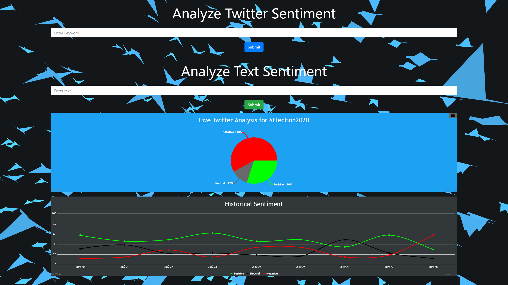

# Twitter Sentiment Analyzer

### Check it out here ! - [Sreek's Sentiment Analyzer](https://sreek-sentiments.herokuapp.com/).

An intelligent Sentiment Analyzer that uses VADER, a Natural Language Processing tool. The web application features both Live Twitter Analysis and Text Sentence Analysis.

The app uses the Twitter API to retrieve and analyze the sentiments of 1000 distinct tweets that will be used to visualize the data through graphs. It features a Live Analysis graph as well as a Historical Sentiment graph.

The Front-End of the Web App was created with JavaScript using the React Library and Bootstrap, while the Back-End was built with Python using the Flask framework.

